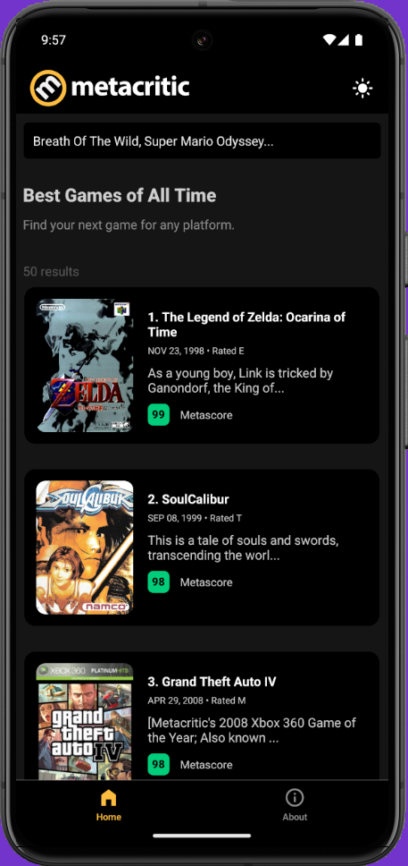
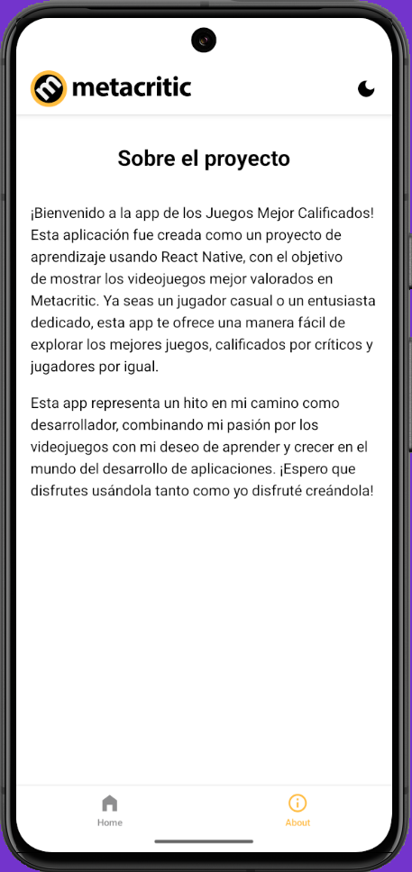
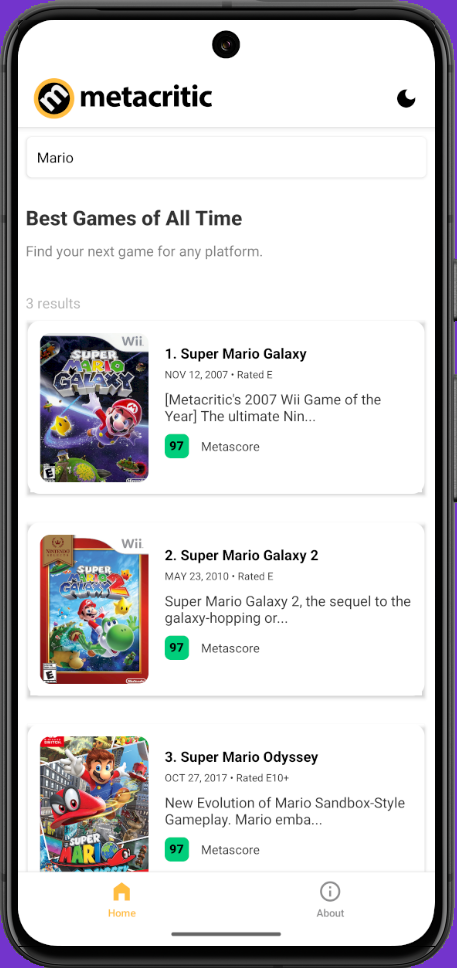

<div align="center">
  
# 🎮 React Native: Metacritic App

</div>

### Aplicación móvil para mostrar los juegos más populares de Metacritic.

<div align='center'>

  

  <br/>

  
  
  <br/>

  
  
  <br/>

  

</div>

## 🚀 Descripción

Este proyecto es una aplicación móvil desarrollada con React Native y Expo, que permite a los usuarios explorar los juegos más populares de Metacritic.

Funciona para dispositivos móviles Android e IOS.

## ⚡ Comenzar

### Prerrequisitos

1. Git.
2. Node.js: cualquier versión a partir de la 20 o superior.
3. Expo Go o un emulador de dispositivos móviles.

## 🔧 Instalación

### Usando npm

1. **Clona el repositorio:**

   ```bash
   git clone https://github.com/abrahamgalue/react-native-metacritic-app.git
   cd react-native-metacritic-app
   ```

2. **Instala las dependencias:**

   ```bash
   npm install
   ```

### Ejecución local (modo desarrollo)

1. **Inicia el servidor de desarrollo:**

   ```bash
   npx expo start
   ```

   Esto iniciará el servidor de desarrollo de Expo, para utilizar la aplicación te recomiendo seguir la [**guía detallada de Expo para configurar tu entorno**](https://docs.expo.dev/get-started/set-up-your-environment/).

## 🎭 Tecnologías

El proyecto utiliza las siguientes tecnologías:

- [**React Native**](https://reactnative.dev/) Para crear aplicaciones móviles. 
- [**Expo**](https://expo.dev/) Como framework de RN.
- [**NativeWind**](https://www.nativewind.dev/) Para los estilos y manejar el tema claro/oscuro.